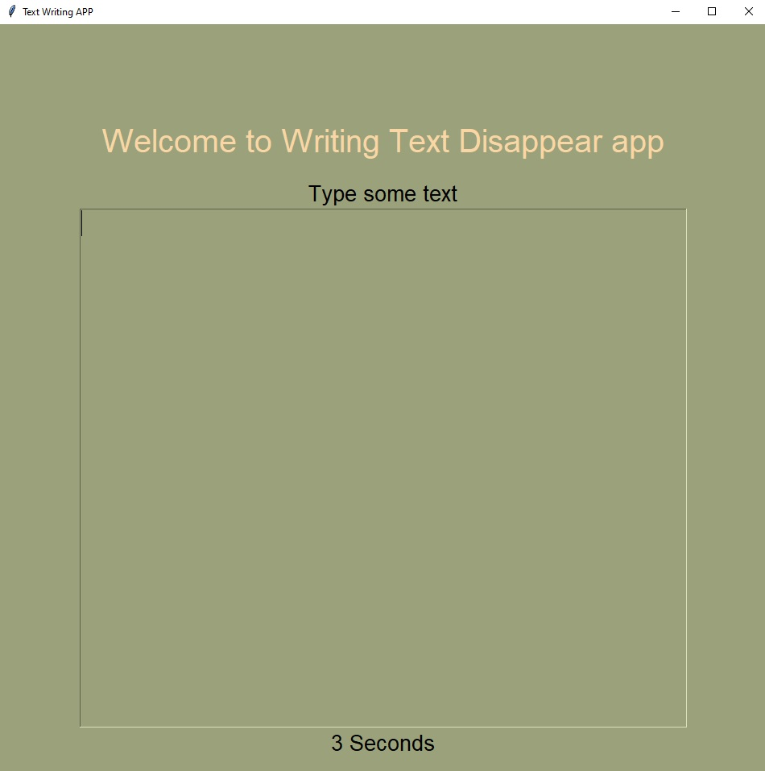

# Disappearing Text Writing App, Python

* I've working on Text writing app where you can take breath for only five seconds between typing. 
  After that you will lose your entire work if you don't keep writing. Put some effort to create basic GUI with 
  functionality. App is made in tkinter module.

* Website that gave me some inspiration:

  [Text Writing Disappear Example](https://www.squibler.io/dangerous-writing-prompt-app)

### Requirements

##### Tkinter Module:

[Tkinter docs](https://docs.python.org/3/library/tkinter.html)

### Usage

* When the app runs, on first typing there is time label which count five seconds. If we being inactive, not typing,
    we'll lose our entire work. App is made to typing continuously with no more breaks then 5 seconds.
  

    
### Ideas for future improvements

##### This project as any other have always space for improvements.
    I use a lot ideas to practice and upgrade my skills.
    
* Improve User Interface, User Experience.
* Add Button to save our text before time runs.
* More padding and styling